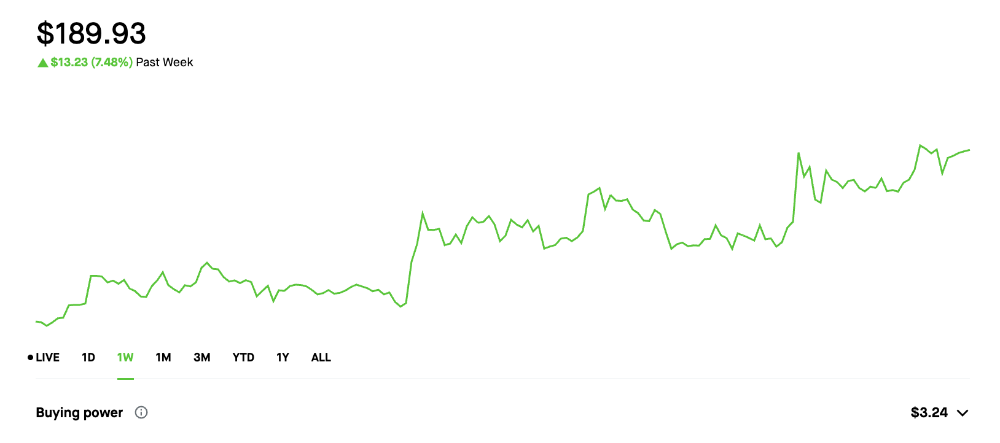

# Sherwood Trading Crypto Bot

Sherwood Trading is a cryptocurrency trading bot designed to automate the process of buying and selling cryptocurrencies based on predefined rules and strategies. The bot is built with Python and uses the Robin Stocks API for executing trades.

## Features

- **Automated Trading**: The bot can automatically execute buy and sell orders based on the signals generated from the technical analysis of the market data.
- **Portfolio Management**: The bot ensures that no more than a certain percentage of the total portfolio is invested in a single currency. If a currency's holdings exceed this limit, the bot will sell the excess amount to maintain a balanced portfolio.
- **Cash Management**: The bot keeps track of the total cash in the account and updates the buying power to be 80% of the total cash, keeping 20% back at all times.

## How it Works

The bot uses three main functions to carry out its operations:

- `signal_engine(df, coin)`: This function performs technical analysis on the market data to generate buy, sell, or hold signals for each coin.
- `action_engine()`: This function executes orders based on the signals generated by the `signal_engine` function.
- `order_crypto(symbol, quantity_or_price, amount_in='dollars', side='buy', bp=None, timeInForce='gtc')`: This function places a buy or sell order for a given cryptocurrency.

After every transaction, the bot checks the balance of the portfolio and adjusts it if necessary to ensure that no more than a certain percentage of the portfolio is invested in a single currency.





## Installation and Usage

1. Clone the repository:
   ```
   git clone https://github.com/grahamwaters/Sherwood_Trading.git
   ```
2. Install the required Python packages:
   ```
   pip install -r requirements.txt
   ```
3. Set up your Robinhood Login details in the configuration file.
4. Run the bot:
   ```
   python main.py
   ```

## Disclaimer

Cryptocurrency trading involves risk, and using an automated trading bot does not guarantee profits. Always use your judgement and never invest more than you can afford to lose. This bot is for educational purposes only and is not financial advice.

---

Please review and modify as necessary. Let me know if there's anything else you'd like me to add or change.
